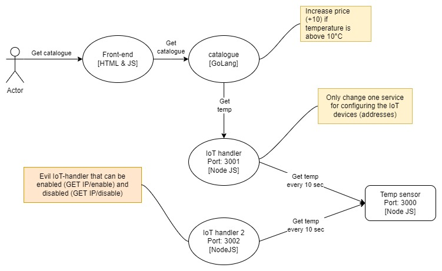
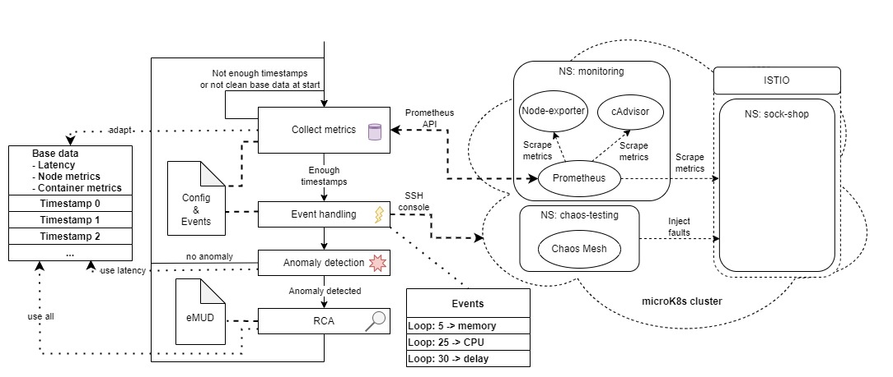

## IoMiRCA : IoT microservice root cause analysis
This project is the source code of the IoMiRCA paper, based on the MicroRCA code with some changes considering IoT devices.


### Testbed
The Testbed is an [adapted version](https://github.com/Minninnewah/microservices-demo) of the [sock-shop](https://github.com/microservices-demo/microservices-demo) microservice testbed to include IoT devices. For that the catalogue service is changed to make a request to the IoT device for every catalogue list request. The whole communication to the IoT device is handled through the IoT-handler. Additionally there's another "evil" IoT-handler that is responsible for the MUD violations.
<center></center>

The load generation is done with a [locust script](https://github.com/Minninnewah/Sock-shop_load)

### Algorithm
<center></center>
The algorithm first collects metrics for the base data. If we have our base data, we loop trough:

1. Get new metrics

2. (Automatically deploy an event based on the config file)

3. Anomaly detection

4. Root cause analysis if anomaly is detected

### Quick start

1. Clone the repository

2. Set up a microK8s cluster and deploy the testbed using the commands in the testbed [readme](https://github.com/Minninnewah/microservices-demo)

3. Run the locust load generation [script](https://github.com/Minninnewah/Sock-shop_load)

4. Run the IoMiRCA algorithm
```
python MicroRCA_online.py --folder 'data' --length 150 --url 'http://10.161.2.161:31090/api/v1/query'
```

## MicroRCA:  Microservices root cause analysis

This project provides the source code of MicroRCA.

### Quick Start
MicroRCA requires data collected from application-level (response times between two communicating services) and system-level (resource usage in container and host). An example of the data is given in folder [data](/data).

#### Presequisite
* python 3+
* [nx](https://networkx.github.io/documentation/stable/index.html)
* sklearn-learn

#### 1. Clone the Repository
`git clone https://github.com/elastisys/MicroRCA.git`

#### 2. Customize the prefix of files
Change the `folder`, `faults_types` and the `file name` of csv files accordingly

#### 3. Run the code and tune parameters
Tune parameters `alpha` and `ad_threshold` with your data.


<!-- ### MicroRCA Overview

<center></center> -->

### MicroRCA Procedures


### Paper Reference
Li Wu, Johan Tordsson, Erik Elmroth, Odej Kao. <br/>
**MicroRCA: Root Cause Localization of Performance Issues in Microservices** <br/>
IEEE/IFIP Network Operations and Management Symposium (NOMS),
20-24 April 2020, Budapest, Hungary <br/>
Download: [[PDF](https://hal.inria.fr/hal-02441640/document#:~:text=MicroRCA%20infers%20root%20causes%20in,propagation%20across%20services%20and%20machines)] [[BibTeX](https://dblp.uni-trier.de/rec/bibtex/conf/noms/WuTEK20)]
